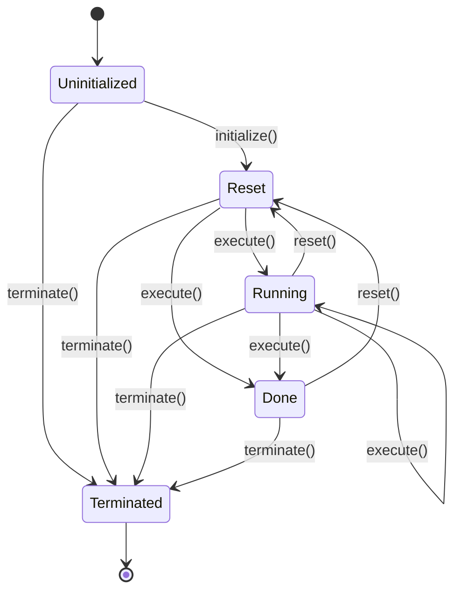

# Component Framework

Components are modular processing units that can be combined to build complex processing systems using graphs.

Components typically function as persistent objects responsible for managing resources, maintaining internal state, and repeatedly processing incoming data. The framework ensures a consistent approach to initialization, state management, execution, and resource cleanup.

A Component class provides an interface to manage it's lifecycle from initialization through termination.

This document describes a minimal BaseComponent class that can be used as a foundation for building more complex processing components.

Opinions:

- BaseComponent should not dictate any input or output mechanisms.  This is left to a downstream design element.
- BaseComponent should not dictate or restrict any concurrency model.
  - Threading models can be introduced through subclasses, otherwise component managers are required to handle threading.
- State transition violations treated as bugs and should raise exceptions - should never happen in production.
- Configuration and monitoring interfaces are optional and not included in this base design.

## Component Lifecycle

The following state diagram illustrates a component's valid states and transitions.



### States

A Component may be in one of the following states.

- **Uninitialized** - Starting state, no resources allocated

- **Reset** - Initialized and ready to execute from clean state

- **Running** - Actively processing

- **Done** - Work completed naturally. No further processing possible until reset.

- **Terminated** - Resources deallocated, terminal state

Note that an Error or Failed state is not included in the base class.  The BaseComponent does not dictate any error reporting or recovery strategies. 

### Lifecycle Methods

These lifecycle methods are intended for external manual or automated lifecycle management and execution scheduling.
Managers are not expected or required to catch and process exceptions during execution runtime to avoid runtime overhead.

A Non-Virtual Interface (NVI) pattern *`do*()` separates public lifecycle methods from user-overridable implementations.

### `bool initialize() noexcept`

- Allocate resources and prepare component.
- Can only be called from Uninitialized state
- Two possible outcomes:
  - On success, transitions to Reset state
  - On failure, state remains Uninitialized
- Allocation failures should leave component in uninitialized state.

`bool doInitialize()`

- All or nothing initialization.  
- Must provide a strong exception guarantee -  either fully initialized or remains uninitialized.  
- No persistent side-effects on failure. 
- Use RAII or similar patterns to ensure cleanup on failure.
- Any failure should return false or throw.

### `void reset()`

- Reinitialize all stateful variables to defaults
- can be called from Running or Done to return to Reset
- Imdepotent - multiple calls from Reset state are no-ops

`void doReset()`

- Reset all internal state variables to their default values
- Re-compute all derived states from scratch


### `bool execute() noexcept`

- Returns done status: true if component has completed work and is now in Done state, false otherwise
- Can be called from Reset or Running states only
- Can be called repeatedly.
- Component may remain in Running state or transtition to Done on natural completion.
- Execute should not throw exceptions for runtime critical performance

`bool doExecute() noexcept` // Return done status
- Perform processing work
- No exceptions
- No dynamic allocations
- Return true if processing is complete and component should transition to Done state, false otherwise

### `void terminate() noexcept`

- Deallocate resources and cleanup
- Must not throw exceptions
- terminate() is idempotent
  - Multiple terminate() calls are allowed and are no-ops after the first. 
- Can be called from any state

`void doTerminate() noexcept`

- Free all allocated resources


## Helper Methods:

### `ComponentState get_state() const noexcept`
- Returns current lifecycle state


### isReady

```cpp
bool isReady() const noexcept { return state == ComponentState::Reset || state == ComponentState::Running; }
```


